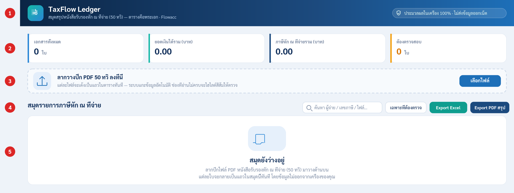
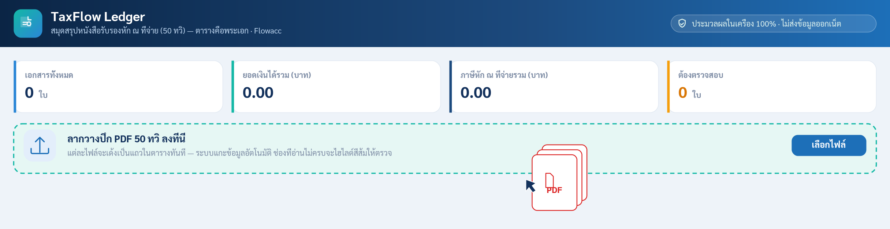
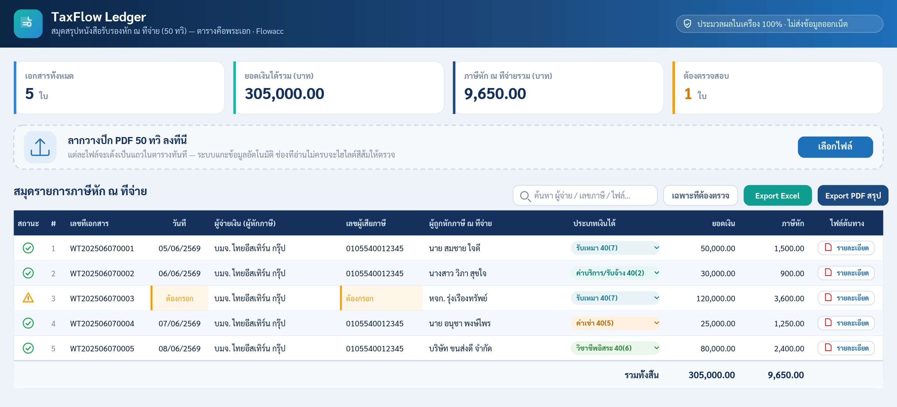
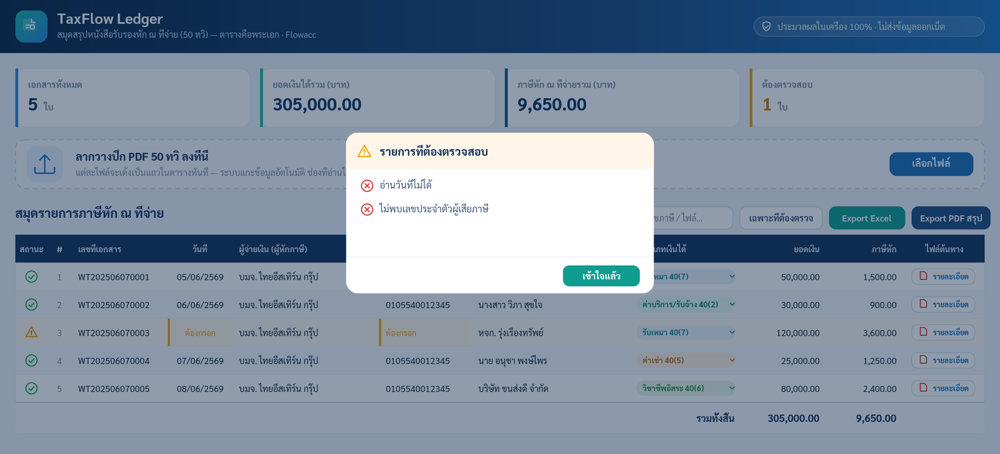
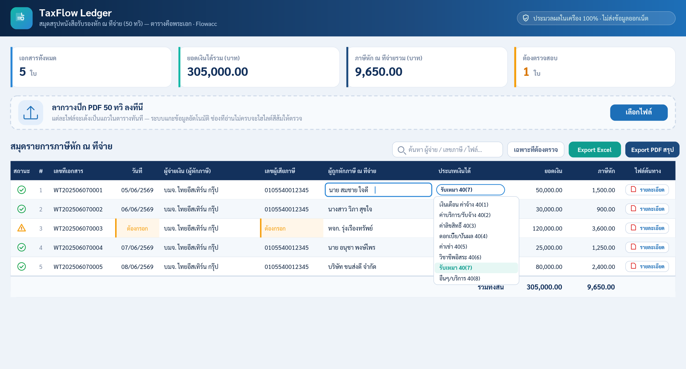
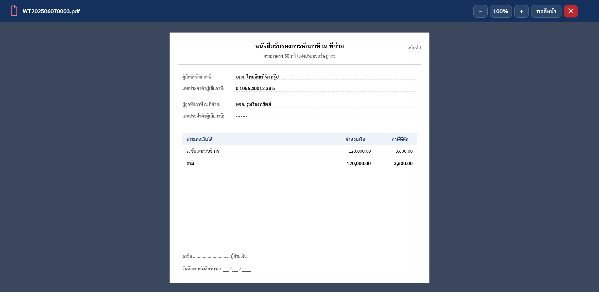
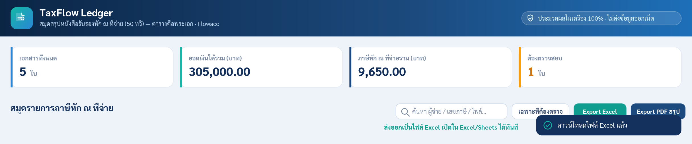

# TaxFlow Ledger — สมุดสรุปหนังสือรับรองหัก ณ ที่จ่าย (50 ทวิ)

> เครื่องมือช่วยสรุปเอกสาร **หนังสือรับรองการหักภาษี ณ ที่จ่าย (50 ทวิ)** จากไฟล์ PDF ให้กลายเป็นตารางสรุปที่แก้ไขและส่งออกได้ทันที — โดย **Flowacc**

**ประมวลผลในเครื่อง 100% · ไม่ส่งข้อมูลภาษีออกสู่อินเทอร์เน็ต**

คู่มือฉบับนี้สำหรับ **พนักงานทั่วไป** เน้นการใช้งานพื้นฐาน

---

## สารบัญ

- [1. แอปนี้คืออะไร](#1-แอปนี้คืออะไร)
- [2. สิ่งที่ต้องเตรียมก่อนใช้งาน](#2-สิ่งที่ต้องเตรียมก่อนใช้งาน)
- [3. รู้จักหน้าจอหลัก](#3-รู้จักหน้าจอหลัก)
- [4. ขั้นตอนที่ 1 — นำเข้าไฟล์ 50 ทวิ](#4-ขั้นตอนที่-1--นำเข้าไฟล์-50-ทวิ)
- [5. ขั้นตอนที่ 2 — ตรวจสอบข้อมูลในตาราง](#5-ขั้นตอนที่-2--ตรวจสอบข้อมูลในตาราง)
- [6. ขั้นตอนที่ 3 — แก้ไขข้อมูลที่ต้องตรวจ](#6-ขั้นตอนที่-3--แก้ไขข้อมูลที่ต้องตรวจ)
- [7. ดูไฟล์ต้นฉบับ (PDF)](#7-ดูไฟล์ต้นฉบับ-pdf)
- [8. ค้นหา กรอง และจัดเรียงข้อมูล](#8-ค้นหา-กรอง-และจัดเรียงข้อมูล)
- [9. ขั้นตอนที่ 4 — ส่งออกผลลัพธ์](#9-ขั้นตอนที่-4--ส่งออกผลลัพธ์)
- [10. ลบแถว และล้างข้อมูลทั้งหมด](#10-ลบแถว-และล้างข้อมูลทั้งหมด)
- [11. ความเป็นส่วนตัวและความปลอดภัย](#11-ความเป็นส่วนตัวและความปลอดภัย)
- [12. ตารางอ้างอิงประเภทเงินได้ 40(1)–40(8)](#12-ตารางอ้างอิงประเภทเงินได้-401408)
- [13. คำถามที่พบบ่อย และข้อควรระวัง](#13-คำถามที่พบบ่อย-และข้อควรระวัง)

---

## 1. แอปนี้คืออะไร

TaxFlow Ledger คือเครื่องมือช่วยสรุป "หนังสือรับรองการหักภาษี ณ ที่จ่าย (50 ทวิ)" ที่อยู่ในรูปไฟล์ PDF ให้กลายเป็นตารางสรุปที่อ่านง่ายและส่งออกได้ทันที เพียงลากไฟล์ PDF มาวาง ระบบจะอ่านข้อมูลในเอกสารแต่ละใบให้โดยอัตโนมัติ แล้วนำมาแสดงเป็นแถวในตาราง พร้อมคำนวณยอดรวมให้

เหมาะสำหรับพนักงานที่ต้องรวบรวมเอกสาร 50 ทวิ หลายใบ เพื่อทำสรุปหรือเตรียมยื่นภาษี โดยไม่ต้องพิมพ์ข้อมูลทีละช่องเอง

> 🔒 **จุดเด่นเรื่องความปลอดภัย:** ข้อมูลทั้งหมดถูกประมวลผลภายในเครื่องคอมพิวเตอร์ของคุณ 100% ไม่มีการส่งข้อมูลภาษีออกไปยังอินเทอร์เน็ต

---

## 2. สิ่งที่ต้องเตรียมก่อนใช้งาน

- ไฟล์หนังสือรับรองหัก ณ ที่จ่าย (50 ทวิ) ในรูปแบบ **PDF** — จะมีกี่ไฟล์ก็ได้ นำเข้าพร้อมกันทั้งปึกได้
- เปิดแอปด้วยเว็บเบราว์เซอร์ทั่วไป (เช่น Google Chrome, Microsoft Edge)
- ไม่ต้องสมัครสมาชิก ไม่ต้องเชื่อมต่ออินเทอร์เน็ตเพื่อส่งข้อมูล และไม่ต้องติดตั้งโปรแกรมเพิ่ม

> ⚠️ **ข้อควรทราบเรื่องไฟล์ PDF:** ระบบอ่านได้เฉพาะ PDF ที่เป็นตัวอักษร (ข้อความ) หากเป็นไฟล์ที่ได้จากการสแกนเป็นรูปภาพ ระบบจะอ่านข้อมูลไม่ได้ ต้องกรอกข้อมูลเองในตาราง

---

## 3. รู้จักหน้าจอหลัก

เมื่อเปิดแอปครั้งแรก จะพบหน้าจอหลักดังภาพ ซึ่งแบ่งเป็น 5 ส่วนสำคัญ

1. **แถบหัวเรื่อง** — ชื่อแอปและป้ายยืนยันว่า "ประมวลผลในเครื่อง 100% ไม่ส่งข้อมูลออกเน็ต"
2. **แถบสรุปยอด** — แสดงจำนวนเอกสารทั้งหมด, ยอดเงินได้รวม, ภาษีหักรวม และจำนวนใบที่ต้องตรวจสอบ (คำนวณสดทุกครั้งที่ข้อมูลเปลี่ยน)
3. **พื้นที่นำเข้าไฟล์** — สำหรับลากไฟล์ PDF มาวาง หรือกดปุ่ม "เลือกไฟล์"
4. **แถบเครื่องมือ** — ช่องค้นหา ปุ่มกรองเฉพาะที่ต้องตรวจ และปุ่มส่งออก (Export Excel / Export PDF สรุป)
5. **ตารางข้อมูล** — หัวใจของแอป แต่ละแถวคือเอกสาร 50 ทวิ หนึ่งใบ ตอนเริ่มต้นจะยังว่างอยู่

---

## 4. ขั้นตอนที่ 1 — นำเข้าไฟล์ 50 ทวิ

มี 2 วิธีในการนำไฟล์เข้าสู่แอป:

1. **ลากไฟล์ PDF** (จะลากทีละไฟล์หรือทั้งปึกก็ได้) มาวางบนพื้นที่นำเข้าไฟล์ — กรอบจะเปลี่ยนเป็นสีเขียวเมื่อพร้อมรับไฟล์
2. หรือกดปุ่ม **"เลือกไฟล์"** แล้วเลือกไฟล์ PDF จากเครื่องของคุณ (เลือกหลายไฟล์พร้อมกันได้)

เมื่อนำเข้าแล้ว แต่ละไฟล์จะกลายเป็นหนึ่งแถวในตารางทันที และระบบจะแกะข้อมูลให้อัตโนมัติ พร้อมขึ้นข้อความแจ้งผล (เช่น อ่านสำเร็จกี่ไฟล์ มีกี่ใบที่ต้องตรวจสอบ)

> ✅ **ระบบกันเอกสารซ้ำให้อัตโนมัติ:** ถ้านำเข้าไฟล์ที่มี "เลขที่เอกสาร" ซ้ำกับที่มีอยู่แล้ว ระบบจะข้ามให้เอง ไม่เพิ่มซ้ำ จึงนำเข้าซ้ำได้อย่างปลอดภัย

---

## 5. ขั้นตอนที่ 2 — ตรวจสอบข้อมูลในตาราง

เมื่อมีข้อมูลแล้ว ตารางจะแสดงรายละเอียดของเอกสารแต่ละใบ และแถบสรุปยอดด้านบนจะอัปเดตให้ทันที

คอลัมน์ในตารางประกอบด้วย: สถานะ, เลขที่เอกสาร, วันที่, ผู้จ่ายเงิน (ผู้หักภาษี), เลขผู้เสียภาษี, ผู้ถูกหักภาษี ณ ที่จ่าย, ประเภทเงินได้, ยอดเงิน, ภาษีหัก และไฟล์ต้นทาง

### ความหมายของไอคอนสถานะ

- ✅ **เครื่องหมายถูกสีเขียว** = ข้อมูลครบถ้วน อ่านได้สมบูรณ์
- ⚠️ **สามเหลี่ยมสีส้ม** = มีข้อมูลที่ต้องตรวจสอบ คลิกที่ไอคอนเพื่อดูว่ามีอะไรต้องแก้

> 🟠 **สำคัญมาก — ต้องตรวจ "ประเภทเงินได้" ทุกแถว:** เนื่องจากฟอร์ม 50 ทวิ พิมพ์รายการเงินได้ทุกประเภทไว้เหมือนกัน ระบบจึงแยกไม่ได้ว่าใบนั้นเป็นประเภทใด จึงตั้งค่าเริ่มต้นให้ทุกใบเป็น **"รับเหมา 40(7)"** เสมอ โปรดเปลี่ยนให้ตรงกับเอกสารจริงด้วยตนเอง

---

## 6. ขั้นตอนที่ 3 — แก้ไขข้อมูลที่ต้องตรวจ

ช่องที่ระบบอ่านไม่ได้หรือข้อมูลไม่ครบ จะถูกไฮไลต์เป็น **สีส้ม** และถ้าว่างจะขึ้นคำว่า "ต้องกรอก" ให้คลิกที่แถวที่มีสถานะสีส้มเพื่อดูรายการที่ต้องตรวจสอบ

### วิธีแก้ไขข้อมูลในช่อง

1. คลิกที่ช่องที่ต้องการแก้ไข (เช่น วันที่ ยอดเงิน หรือชื่อ) แล้วพิมพ์ข้อมูลที่ถูกต้อง
2. กดปุ่ม **Enter** หรือคลิกที่อื่นเพื่อบันทึก ระบบจะตรวจสอบและอัปเดตสถานะให้ทันที
3. สำหรับ "ประเภทเงินได้" ให้กดที่ป้ายสีในช่องนั้น แล้วเลือกประเภทที่ถูกต้องจากรายการ 40(1)–40(8)

เมื่อกรอกข้อมูลครบและถูกต้องแล้ว ไอคอนสถานะของแถวนั้นจะเปลี่ยนจากสามเหลี่ยมสีส้มเป็นเครื่องหมายถูกสีเขียวเอง

---

## 7. ดูไฟล์ต้นฉบับ (PDF)

หากต้องการเทียบข้อมูลในตารางกับเอกสารจริง ให้กดปุ่ม **"รายละเอียด"** ในคอลัมน์ไฟล์ต้นทางของแถวนั้น แอปจะเปิดหน้าต่างแสดงไฟล์ PDF ต้นฉบับขึ้นมา

- ใช้ปุ่ม **+ / −** เพื่อซูมเข้า–ออก หรือกด **"พอดีหน้า"** ให้พอดีความกว้าง
- กดปุ่มกากบาทสีแดง หรือปุ่ม **Esc** เพื่อปิดหน้าต่าง

การเปิดดูไฟล์นี้ก็ทำงานในเครื่องเช่นกัน ไฟล์ของคุณไม่ถูกส่งออกไปไหน

---

## 8. ค้นหา กรอง และจัดเรียงข้อมูล

- **ค้นหา** — พิมพ์ในช่องค้นหาเพื่อกรองตามชื่อผู้จ่าย เลขผู้เสียภาษี ชื่อผู้ถูกหัก เลขที่เอกสาร หรือชื่อไฟล์
- **กรองเฉพาะที่ต้องตรวจ** — กดปุ่ม "เฉพาะที่ต้องตรวจ" เพื่อแสดงเฉพาะแถวที่ยังมีข้อมูลไม่ครบ ช่วยให้ตามแก้ได้ครบทุกใบ
- **จัดเรียง** — คลิกที่หัวคอลัมน์ (เช่น วันที่ หรือ ยอดเงิน) เพื่อเรียงข้อมูล กดซ้ำเพื่อสลับจากน้อยไปมาก/มากไปน้อย

---

## 9. ขั้นตอนที่ 4 — ส่งออกผลลัพธ์

เมื่อตรวจสอบข้อมูลครบถ้วนแล้ว สามารถส่งออกได้ 2 รูปแบบจากปุ่มบนแถบเครื่องมือ

1. **Export Excel** — ดาวน์โหลดเป็นไฟล์ตาราง เปิดใน Microsoft Excel หรือ Google Sheets ได้ทันที จัดรูปแบบสวยงาม พร้อมยอดรวม
2. **Export PDF สรุป** — สร้างรายงานสรุป 1 หน้ากระดาษ A4 พร้อมช่องลงนามผู้จัดทำ/ผู้ตรวจสอบ/ผู้อนุมัติ เมื่อหน้าต่างพิมพ์เปิดขึ้น ให้เลือกปลายทางเป็น **"บันทึกเป็น PDF" (Save as PDF)** แล้วกดบันทึก

---

## 10. ลบแถว และล้างข้อมูลทั้งหมด

- **ลบทีละแถว** — กดไอคอนถังขยะที่ท้ายแถวที่ต้องการลบ
- **ล้างทั้งหมด** — กดปุ่ม "ล้างทั้งหมด" เพื่อลบทุกแถวออกจากสมุด ระบบจะถามยืนยันก่อน

> ⚠️ **ข้อควรระวัง:** การลบและการล้างข้อมูลย้อนกลับไม่ได้ และข้อมูลในตารางจะหายเมื่อปิดหรือรีเฟรชหน้าเว็บ จึงควรส่งออก (Export) เก็บไว้ก่อนปิดทุกครั้ง

---

## 11. ความเป็นส่วนตัวและความปลอดภัย

TaxFlow Ledger ประมวลผลทุกอย่างภายในเบราว์เซอร์บนเครื่องของคุณ ทั้งการอ่านไฟล์ PDF การแกะข้อมูล และการดูไฟล์ต้นฉบับ ข้อมูลภาษีของคุณไม่ถูกอัปโหลดหรือส่งออกไปยังเซิร์ฟเวอร์ใด ๆ บนอินเทอร์เน็ต

เพราะข้อมูลเก็บอยู่ในหน้าเว็บชั่วคราวเท่านั้น เมื่อปิดหรือรีเฟรชหน้า ข้อมูลจะหายไป จึงควรส่งออกเก็บไว้เสมอ

---

## 12. ตารางอ้างอิงประเภทเงินได้ 40(1)–40(8)

ใช้ตารางนี้ช่วยเลือก "ประเภทเงินได้" ให้ตรงกับเอกสารแต่ละใบ

| รหัส | ประเภทเงินได้ | ตัวอย่าง |
|------|----------------|----------|
| 40(1) | เงินเดือน ค่าจ้าง | เงินเดือน โบนัส ค่าจ้างประจำ |
| 40(2) | ค่าบริการ / รับจ้าง / นายหน้า | ค่าคอมมิชชั่น ค่าจ้างทำงานให้ |
| 40(3) | ค่าลิขสิทธิ์ / สิทธิ | ค่าลิขสิทธิ์ ค่ากู๊ดวิลล์ |
| 40(4) | ดอกเบี้ย / เงินปันผล | ดอกเบี้ยเงินฝาก เงินปันผล |
| 40(5) | ค่าเช่า | ค่าเช่าอาคาร ที่ดิน ทรัพย์สิน |
| 40(6) | วิชาชีพอิสระ | แพทย์ ทนายความ วิศวกร บัญชี |
| 40(7) | รับเหมา | รับเหมาก่อสร้าง พร้อมจัดหาของ |
| 40(8) | อื่น ๆ / บริการ | ค่าบริการอื่นที่ไม่เข้าข้ออื่น |

---

## 13. คำถามที่พบบ่อย และข้อควรระวัง

**ถาม: ทำไมบางช่องเป็นสีส้ม?**
ตอบ: หมายความว่าระบบอ่านข้อมูลในช่องนั้นไม่ได้หรือไม่ครบ ให้คลิกแก้ไขและกรอกข้อมูลให้ถูกต้อง สถานะจะกลายเป็นสีเขียวเอง

**ถาม: นำเข้าไฟล์แล้วทุกช่องว่างเปล่า เพราะอะไร?**
ตอบ: ไฟล์นั้นอาจเป็น PDF ที่ได้จากการสแกนเป็นรูปภาพ ซึ่งไม่มีตัวอักษรให้อ่าน สามารถกรอกข้อมูลเองในตารางได้

**ถาม: ทำไมประเภทเงินได้ขึ้นเป็น "รับเหมา 40(7)" ทุกใบ?**
ตอบ: เป็นค่าเริ่มต้นที่ระบบตั้งไว้ เพราะไม่สามารถแยกประเภทจากฟอร์มได้อัตโนมัติ โปรดเลือกประเภทให้ถูกต้องด้วยตนเองทุกแถว

> 🔴 **ข้อควรระวังสำคัญที่สุด:** ข้อมูลที่ระบบแกะมาให้เป็นการอ่านอัตโนมัติ อาจมีคลาดเคลื่อน โปรดตรวจทานข้อมูลทุกแถวกับเอกสารต้นฉบับให้ถูกต้องทุกครั้งก่อนนำไปยื่นจริง

---

TaxFlow Ledger · เครื่องมือสรุปหนังสือรับรองหัก ณ ที่จ่าย (50 ทวิ) สำหรับบุคคลทั่วไป — โดย Flowacc · ปรับปรุงล่าสุด: มิถุนายน 2569

<!--
หมายเหตุการติดตั้ง: รูปประกอบอยู่ในโฟลเดอร์ img/ ที่อยู่ระดับเดียวกับ README.md นี้
(img/01_overview.png ถึง img/07_export.png) หากย้าย README ไปที่อื่น ให้ย้ายโฟลเดอร์ img ไปด้วย
-->
